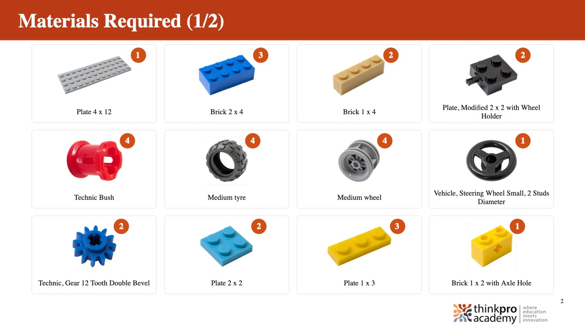
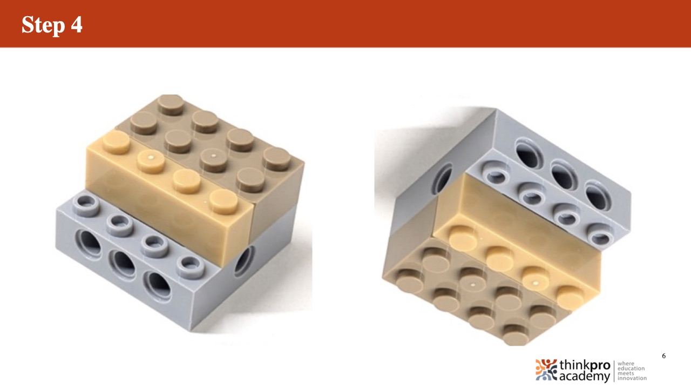
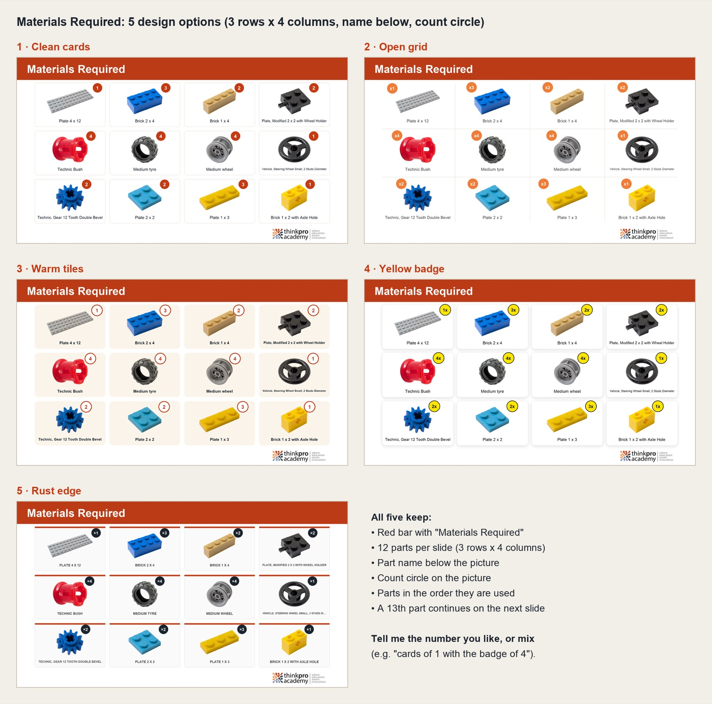

# Build PPT Designer

A phone-first web app for making ThinkPro **build instruction decks** (PowerPoint) and standalone **BOMs** (parts lists) with the **BOM Designer**.

1. **New build**: enter the build name, grade and session.
2. **📷 Add step**: take the photo of the step (or use **🖼 Add steps from gallery** to pick one or more saved photos; each becomes a step, in the order selected), choose the part(s) it uses from the parts list, and type the instruction exactly as it should read on the slide. Steps where no part is added (the model is flipped, turned or just shown again) use **Use previous image**: their slide shows the previous step's photo (before) on the left and this step's photo (after) on the right.
**BOM Designer:** the **BOM Designer** button on the home screen makes a standalone Materials Required deck: choose any parts from the library (or add all of them), set the quantities, and generate. The deck has only the Materials slides (12 per slide, no cover, steps or Thank You). Grade and session are optional.

3. **Materials required** (the BOM) fills itself in from the parts chosen in the steps, with quantities added up. **Review & edit BOM** lets you change a quantity, hide a part or add an extra part that is not in any step. Edits sit on top of the automatic list, so it keeps updating as steps change, and ↺ returns a part to its automatic count.
4. **Generate deck** makes `<Build>_G<grade>_S<session>_v<n>.pptx`:
   - slide 1: cover with the build name, grade and session
   - slide 2: **Materials Required**, 3 rows × 4 columns of white part cards, each outlined in its own box: picture with a soft shadow under it, name below it, and a light orange "x 3" count label in the card's corner (a 13th part continues on another Materials slide)
   - from slide 3: one slide per step, with "Step N" on the red bar, the instruction highlighted in yellow, the part(s) on the left (up to 3 different parts, stacked in one column) and the step photo on the right, centred in its own area (not on the slide). By default the parts take 20% of the width and the photo 80%. Next to each part is its name and count ("Plate 2 x 2 - 2", count in bold red; just the name for a single piece), using the free space before the photo; label size 14–24 pt, 18 by default, and names can be turned off per step (then only "x 2"). Each step can also put the label **beside** the part (default) or **under** it. Every build made before these standards shows an **Update design to latest design standards** banner (the button is also always in the ⋯ menu) that moves every step to the current defaults. Per step you can set the part/photo split with a slider from 10% – 90% to 90% – 10%; new steps copy the previous step's settings, and "Use this layout for all steps" applies them everywhere. The photo editor's "Slide" crop matches the step's photo area, so a wider split gets a wider photo
   - last slide: Thank You

**Materials grid:** on the Materials screen of a build or a BOM Designer list, choose the grid (2×2, 3×2, 3×3, 4×3, 5×3, 5×4 or 6×4, i.e. 4 to 24 parts per slide); cards, pictures, names and count labels scale to fit. **Page** sets the colour behind the cards (White, Cream, Sand or Peach), and **Parts** switches between one picture with its count and **Show every piece** (the part drawn once per piece, up to 6). Tap a part's name (✎) to rename it for that build only; the new name is used on the Materials and step slides, and "Use library name" undoes it.

**Per step, on the slide:** a **custom left picture** (replaces the part pictures, or the before photo on a flip/turn step), a **One picture, centred** layout (just the step photo), and **✏️ edit a part's picture** (mirror, rotate, crop, marks…) for that slide only; the BOM keeps the library picture. In the photo editor, arrows, circles, boxes and text labels stay editable: tap one to resize it with its handles (or edit its text), move it, or change its colour and size. Step instructions are 24 pt.

**On a laptop** the app uses the width: the step editor shows a large slide preview beside the controls, builds and steps are shown as grids, and the part picker and photo editor open as side-by-side panels. Drag photos onto a build to add them as steps, or onto a step (or paste one with ⌘V / Ctrl+V) to use it as that step's photo. ← / → move between steps and Esc closes the part picker. Phones keep the one-column layout.

Builds are saved in the browser on the device they were made on. To edit a build later on another phone or laptop, or to keep a backup, use **⋯ → Save build file** and **Open build file**. On iPhone, add the app to the Home Screen (Share → Add to Home Screen) so Safari keeps its saved builds.

Everything runs in the browser, and nothing is uploaded.

## Photo editor

After a photo is taken (or with **✏️ Edit photo** on any step) a full editor opens: crop with presets (Free, Slide, 1:1, 4:3, 3:4), rotate, mirror, straighten, **remove background**, adjust (Auto, brightness, contrast, saturation, warmth, whites, sharpen) and mark (arrows, circles, boxes and text labels such as "5 studs", in five colours). The original photo is kept, so edits can be changed later without losing quality.

**Background removal** runs on the phone with [ISNet](https://github.com/xuebinqin/DIS) (via [transformers.js](https://huggingface.co/docs/transformers.js)). The model is downloaded once from Hugging Face: 84 MB on phones whose browser has a GPU with 16-bit support (under a second per photo), 42 MB otherwise (processor only, about 20–40 seconds). Erase and Restore brushes fix anything the model gets wrong.

## AI suggestions for instructions

**✨ Improve with AI** under a step's instruction (or **✨ Write with AI** when it is empty) offers three instructions in the house style (Corrected, Clearer, Shorter) that name both the part being added and the part it goes onto, with the stud position when the photo shows it. Pick the part it attaches to under **Goes onto** (optional) for the most reliable result. Tap a suggestion to use it; Undo puts the old text back. It needs the internet. The suggestions come from Google Gemini (free tier) through a small proxy on the Lesson Foundry server that keeps the API key private (`server/`). Sent: the instruction, the step's parts, the parts of the last 8 steps, the "Goes onto" choice, the grade, the step number and the step photo (about 700 px).

## Licence

GNU AGPL-3.0 (see `LICENSE`), because the background-removal model (ISNet) is AGPL-3.0. Anyone may use the app, including commercially, and its source code stays public here. Decks, photos and build files made with the app are yours and are not affected.

## Parts libraries

`public/library/kits.json` lists the kits; each kit has a folder of pictures and a `parts.json` (`id`, `name`, `file`, `w`, `h`).
The Xplorer (Mech) pictures and names are a snapshot of the BOM maker library on glbadmin.thinkpro.academy (`/content/bom/Parts_Library/Xplorer_Mech`, taken 2026-09-29), resized to 600 px. The PeeCee pictures (20 parts) come from the kit photos supplied on 2026-10-01, trimmed, put on white and resized to 600 px.
To add Innovator, Computational or Tronix, add a folder the same way and list it in `kits.json`.

## Slide layout

All positions, sizes and colours are in `LAYOUT` at the top of `src/deck.js`. They use the same 1280 × 720 design-pixel system, backgrounds and fonts as Lesson Foundry. The phone preview uses the same numbers.

## Develop

```
npm install
npm run dev
```

Pushing to `main` builds the app and publishes it to GitHub Pages (`.github/workflows/deploy.yml`).

---

## Portfolio notes

*A case study of this project, kept for a future portfolio.*

### In one line

A phone app that turns "photograph each build step" into a finished, on-brand PowerPoint instruction deck for ThinkPro Academy. It includes an automatic parts list, an AI photo editor and AI-written instructions, and runs at zero ongoing cost.

**Live:** https://sherlyguides.github.io/build-steps/ · **Built:** September 2026 (first version to AI features in two days)

### The problem

ThinkPro Academy teaches with construction kits. Every model needs a step-by-step build deck: one slide per step, with the part to use, a photo of the step and a one-line instruction. These were made by hand in PowerPoint, which was slow, inconsistent from person to person, and painful to update. Changing one photo or instruction meant redoing slides, and a build can have anywhere from 2 to 200 steps.

### What I built

| Area | What it does |
|---|---|
| **Build flow** | New build (name, grade, session), then per step: 📷 photo, pick parts from the kit's parts library, write the instruction. Steps can be reordered, inserted, deleted, or added in bulk from the gallery. |
| **Deck generation** | One tap produces the `.pptx` on the phone: cover, **Materials Required**, one slide per step, Thank You. It uses the same slide design and layout system as the team's existing lesson generator, so decks look house-made. |
| **Automatic bill of materials** | The Materials slide is worked out from the steps: parts in order of first use, quantities totalled. It keeps updating as steps change, and manual edits (spares, hidden parts, extras) sit on top of the automatic list. |
| **Flip / turn steps** | Steps that add no part show "before" and "after" photos side by side. |
| **Photo editor** | Crop (including the slide's exact aspect), rotate, straighten, auto-enhance and adjustments, arrows, circles and boxes to point at the new part, and **AI background removal** with erase/restore brushes. Originals are kept, so edits are non-destructive. |
| **AI instructions** | ✨ suggests three instructions in the house style that name the part being added *and* the part it attaches to, with stud positions read from the step photo. |
| **Saving and sharing** | Builds are saved on the device and can be exported as one backup file (photos, originals and cut-outs) and reopened on another phone. It installs to the home screen and works offline, except for AI suggestions. |




### Key decisions and trade-offs

- **Web app instead of an Android APK.** The brief was an APK. I switched to an installable web app, because the same code then runs on iPhone, Android and laptops, testers need only a link, and updates reach everyone on the next launch. The APK tooling (Capacitor, Android SDK) was removed.
- **Everything client-side where possible.** Deck generation (PptxGenJS), storage (IndexedDB) and the photo editor run in the browser. Hosting is free static GitHub Pages, and no server is needed for the core app.
- **Background removal on the phone.** I first tried **BiRefNet** (state of the art, MIT licence), but it hit a hardware limit on Apple GPUs in every browser runtime (a shader needed 11 storage buffers where the device allows 10) and ran out of memory on the CPU. I switched to **ISNet**: 84 MB on WebGPU, under a second per photo, with an automatic fallback to a 42 MB 8-bit model on phones without a usable GPU. ISNet is AGPL-3.0, so the app is open source under AGPL.
- **Choosing the AI for instructions, three times.** Claude through a proxy was judged too much setup for an app this size. A ~400 MB on-phone language model was considered and rejected: too big to download on each phone, too weak at keeping part names exact. The final choice was **Gemini 3.5 Flash-Lite on the free tier**, behind a small proxy on an existing server so the API key never ships in the public app.
- **Asking the human instead of guessing.** The AI could not reliably tell from one photo which part a new piece sits on. Rather than a bigger model, I added an optional **"Goes onto"** choice, and with it the suggestions were correct every time in testing.
- **Design by options.** For the Materials slide I rendered five design options on real part pictures, then a second round in a new grid, and the chosen design became the layout used by both the deck and the in-app preview.



### Technical highlights

- **One layout, two renderers.** Every slide position lives in one design-pixel system (1280 × 720). The same numbers drive PowerPoint (PptxGenJS) and the live HTML preview (CSS container units), so the preview matches the deck exactly.
- **PowerPoint text fitting.** PowerPoint only shrinks text to fit once someone edits it, so long names and instructions are pre-sized in code and wrap onto two lines instead of overflowing.
- **Non-destructive photo pipeline.** original → rotate/straighten (one matrix) → crop → cut-out composite → adjustments (lookup tables, sharpening) → marks stored in the original photo's coordinates, so they stay attached through any later rotate or crop. It renders at preview size while you edit and at 1,600 px on save.
- **Small, locked-down AI proxy.** Python standard library only, a systemd service with a dynamic user and memory cap, Caddy with automatic Let's Encrypt HTTPS via an sslip.io hostname (no DNS needed), an origin allow-list, per-phone and daily rate limits, structured JSON output, a fallback model, and no request bodies logged.
- **Phone details that matter.** The camera opens straight from the tap (browsers only allow that from a user gesture), sharing uses the Web Share API behind its own button (a long deck outlasts the tap's permission), photos are stored at up to 2,000 px, and the app saves its data persistently so Safari doesn't clear it.

### Results

- A deck of any length is **one tap** once the steps exist. Updating one photo or instruction and regenerating takes seconds, and the version number increases automatically.
- **Zero running cost:** GitHub Pages, on-device background removal, the Gemini free tier (500 suggestions a day) and a free HTTPS certificate on a server that was already running.
- **Measured:** background removal about 1.5 s per photo on a GPU (about 9 s on a laptop CPU), AI suggestions about 1–3 s.

### Stack

JavaScript (ES modules, Vite) · PptxGenJS · JSZip · IndexedDB · Service worker / web app manifest · Canvas 2D · transformers.js + ONNX Runtime Web (WebGPU / WASM) · ISNet · Python (standard library) · Google Gemini API · Caddy · systemd · AWS EC2 · GitHub Actions + GitHub Pages

### What I would do next

- Add the Innovator, Computational and Tronix parts libraries.
- Test on more real phones and collect real build photos to tune background removal (shadows, Technic holes, thin axles).
- Offer an optional team account so builds sync between devices instead of moving by backup file.
- Build a small evaluation set of real steps to measure the AI instructions before changing the prompt or model.

*Built with the help of Claude Code as a pair-programmer.*
